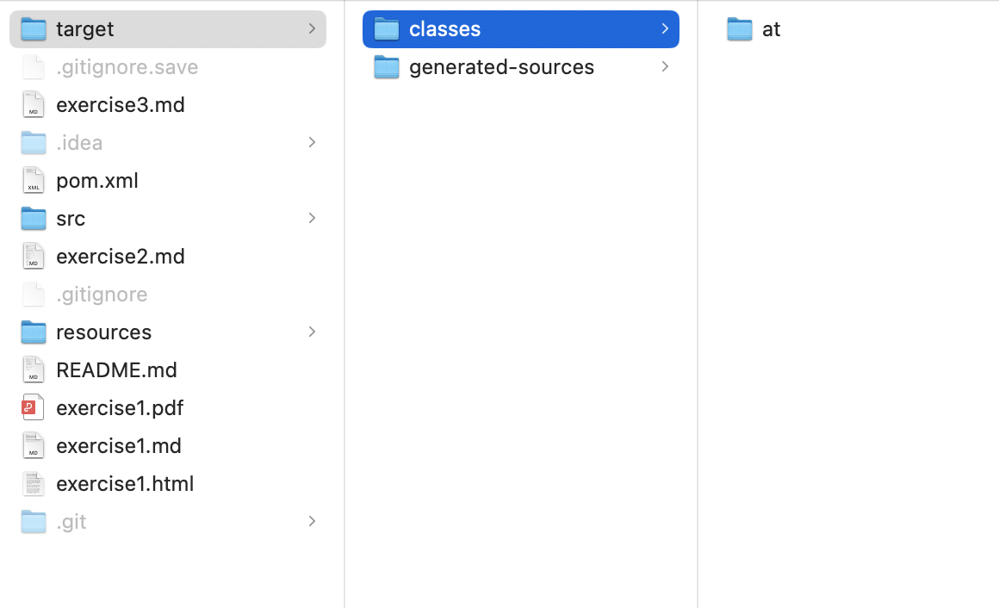
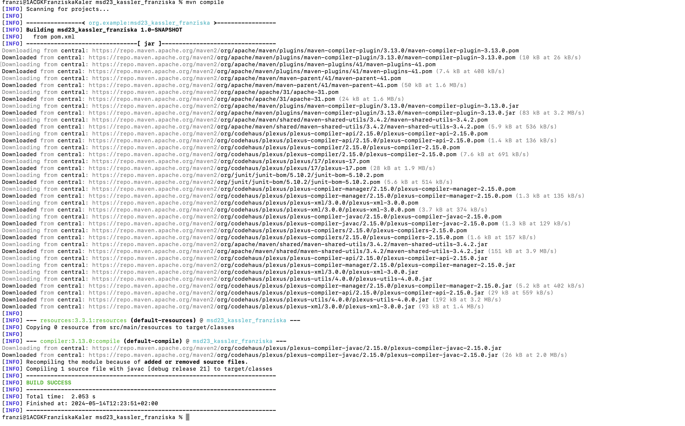

# Exercise 3

Abrbeitsschritte:
- Commit bezüglich der neuen Dokuemnte 
- Erstelle die Methoden für den Rechner
  
  Nach der ersten Ausführung sollten Sie einen zusätzlichen Ordner in Ihrem Projekt sehen. Dokumentieren Sie bitte, welcher Ordner neu erstellt wurde.
Ordner **at** wurde in msd23_kassler_franziska/src/main/java/at erstellt.

