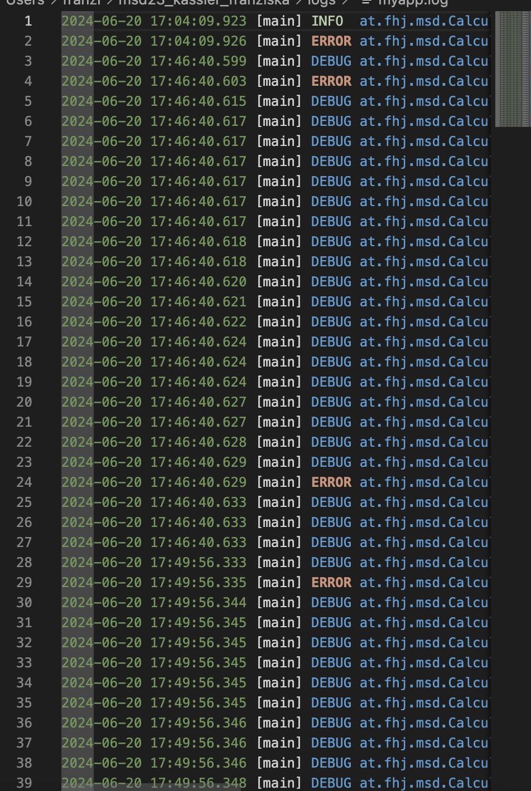

# Exercise 5

*Was fällt Ihnen dabei auf?*

die Log-Einträge haben – wie beabsichtigt – unterschiedliche Log-Level, die die Bedeutung der Log-Einträge besser nachvollziehbar machen.

- *Warum werden Logging Bibliotheken verwendet?*
  
  um Informationen über den Ablauf des Programms zu protokollieren. Das kann in Folge dabei hilfreich sein, den Programmfluss besser zu verstehen. 

- *Welche Log-Level gibt es in Log4J und was hat es damit auf sich?*
  
    helfen dabei, die Wichtigkeit der protokollierten Nachrichten anzugeben. Es gibt:
    
    TRACE: Detaillierte Informationen, die normalerweise nur zur Entwicklungszeit relevant sind.
    
    DEBUG: Informationen zum Debuggen und zur Fehlerbehebung.

    INFO: Informationen zum normalen Betriebsablauf, um den Status und wichtige Ereignisse anzuzeigen.

    WARN: Potenziell problematische Situationen, die beachtet werden sollten.

    ERROR: Fehler oder Ausnahmen, die das Programm beeinträchtigen, aber es weiterlaufen lassen.

    FATAL: Schwerwiegende Fehler, die das Programm zum Absturz bringen könnten.

 
- *Was für Konfigurationsmöglichkeiten bietet Ihnen log4J?*
  
    Festlegen von Appendern, die bestimmen, wohin die Lognachrichten geschrieben werden (z.B. Konsole, Dateien, Datenbanken).

    Definieren von Loglevel für verschiedene Teile des Codes oder für spezifische Klassen.

    Formatieren von Lognachrichten mit Mustern, um Zeitstempel, Klassenname, Nachrichteninhalt usw. anzuzeigen.

    Aktivieren von Logrotation und Größenbeschränkungen für Logdateien, um Speicherplatz zu verwalten und alte Daten zu behalten oder zu löschen.

